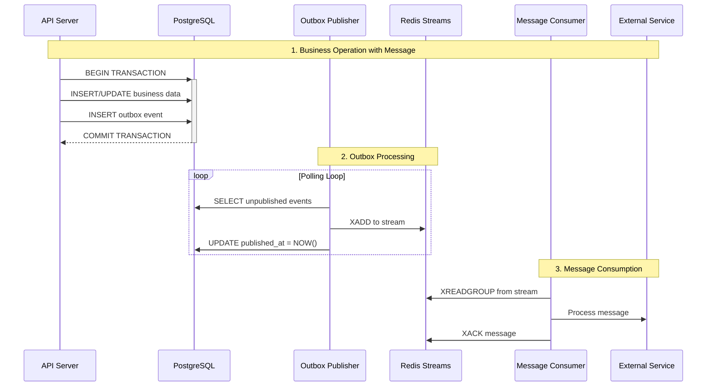

# Transactional Outbox Pattern with Go, PostgreSQL, and Redis

このプロジェクトは、Go、PostgreSQL、Redis Streamsを使用したトランザクションアウトボックスパターンの実装サンプルです。

参考: https://docs.aws.amazon.com/ja_jp/prescriptive-guidance/latest/cloud-design-patterns/transactional-outbox.html

## 技術スタック

- **Go 1.21+**: アプリケーションロジック
- **PostgreSQL**: メインデータベース + アウトボックステーブル
- **Redis Streams**: メッセージング・イベント配信
- **rueidis v1.0.62**: 高性能Redis Goクライアント
- **sqlc**: タイプセーフなSQLコード生成
- **golang-migrate**: データベースマイグレーション
- **pgx/v5 v5.7.5**: PostgreSQL接続プール
- **caarlos0/env v11.3.1**: 環境変数管理
- **golangci-lint v2**: コード品質管理

## アーキテクチャ

トランザクションアウトボックスパターンは、分散システムにおいてデータベースの変更とメッセージの送信を確実に行うためのパターンです。



## 主要コンポーネント

### 1. API Server (`cmd/api/`)
- HTTPリクエストを処理するAPIエンドポイント
- Service層を通じてビジネスロジックを実行
- データベースへの変更とアウトボックスへのイベント挿入を同一トランザクション内で実行

### 2. Outbox Table
```sql
CREATE TABLE IF NOT EXISTS outbox_events (
    id BIGSERIAL PRIMARY KEY,
    aggregate_id VARCHAR(255) NOT NULL,
    event_type VARCHAR(100) NOT NULL,
    payload JSONB NOT NULL,
    created_at TIMESTAMP DEFAULT CURRENT_TIMESTAMP,
    published_at TIMESTAMP NULL
);

-- Create indexes for efficient querying
CREATE INDEX IF NOT EXISTS idx_outbox_unpublished ON outbox_events (created_at) WHERE published_at IS NULL;
CREATE INDEX IF NOT EXISTS idx_outbox_aggregate_id ON outbox_events (aggregate_id);
```

### 3. Outbox Publisher (`cmd/publisher/`)
- 未発行のイベントを定期的にポーリング
- Redis Streamsへの発行
- 発行済みフラグ（`published_at`）の更新

### 4. Message Consumer (`cmd/consumer/`)
- Redis Streamsからのメッセージ受信
- 外部サービスへの通知（例：ウェルカムメール送信）
- Consumer Groupsによる負荷分散


## セットアップ

### 前提条件
- Go 1.21+
- Docker & Docker Compose
- PostgreSQL (Dockerで提供)
- Redis (Dockerで提供)

### 起動

1. リポジトリのクローン
```bash
git clone <repository-url>
cd transactional-outbox-pattern
```

2. 依存関係とツールのインストール
```bash
make deps
```

3. インフラストラクチャの起動
```bash
docker-compose up -d
```

**接続確認**
```bash
# コンテナ状態確認
docker compose ps

# PostgreSQL接続確認
docker exec -it postgres pg_isready -U user -d outbox_db

# Redis接続確認
docker exec -it redis redis-cli ping
```

4. データベースマイグレーション
```bash
make migrate-up
```

5. sqlcコード生成
```bash
make gen
```

6. アプリケーションの起動
```bash
# ターミナル1: API Server (リクエスト待受開始)
go run cmd/api/main.go

# ターミナル2: Outbox Publisher（ポーリング開始）
go run cmd/publisher/main.go

# ターミナル3: Email Service Consumer（メッセージ待機）
go run cmd/consumer/main.go
```

## API エンドポイント

### ユーザー作成
```bash
curl -X POST http://localhost:8080/users \
  -H "Content-Type: application/json" \
  -d '{"name": "John Doe", "email": "john@example.com"}'
```

### ユーザー取得
```bash
curl "http://localhost:8080/users/get?id=1"
```

### ヘルスチェック
```bash
curl http://localhost:8080/health
```

## マイグレーションコマンド

```bash
# マイグレーション実行
make migrate-up

# マイグレーション全リセット
make migrate-down

# 現在のマイグレーションバージョン確認
make migrate-version

# 新しいマイグレーション作成
make migrate-create NAME=add_user_status

# sqlcコード生成
make gen
```

## 動作確認

1. 各サービスが正常に起動していることを確認
2. APIでユーザー登録
3. PostgreSQL outbox_eventsテーブルを確認
4. Redis Streamsのメッセージを確認
```bash
docker exec -it redis redis-cli XREAD STREAMS user:events 0-0
```

### 動作フロー
1. API → ユーザー登録 + outboxイベント作成
2. Publisher → outboxイベントをRedisに発行
3. Consumer → Redisからメッセージ受信 → ウェルカムメール送信

## 利点

- **データ整合性**: データベース変更とメッセージ送信の原子性保証
- **信頼性**: メッセージの確実な配信
- **スケーラビリティ**: Consumer Groupsによる水平スケーリング
- **監視可能性**: Redis Streamsによるメッセージ状態の追跡

## Redis Streams操作

### 基本概念
- **Stream**: メッセージのログ（例: `user:events`）
- **Consumer Group**: 複数のConsumerでメッセージを分散処理
- **Consumer**: Groupに属する個別の処理プロセス
- **Message ID**: タイムスタンプベースの自動生成ID（例: `1640995200000-0`）

### Redis 主要コマンド

#### XADD - メッセージ追加（Producer）
```bash
# 基本構文
XADD <stream> <ID> <field> <value> [<field> <value> ...]

# 実際の例
XADD user:events * event_type user_created aggregate_id user_1 payload '{"user_id":1,"name":"John"}'

# オプション
XADD user:events MAXLEN 1000 * event_type user_created data '{"key":"value"}'  # ストリーム最大長制限
```

**説明**: 
- `*` = 自動ID生成（タイムスタンプベース）
- フィールド・値のペアで構造化データを格納
- 返り値: 生成されたメッセージID（例: `1640995200000-0`）

#### XGROUP - Consumer Group管理
```bash
# Consumer Group作成
XGROUP CREATE <stream> <group> <start-id> [MKSTREAM]
XGROUP CREATE user:events email-service 0 MKSTREAM

# Consumer Group削除
XGROUP DESTROY <stream> <group>
XGROUP DESTROY user:events email-service

# Consumer削除（Group内の特定Consumer）
XGROUP DELCONSUMER <stream> <group> <consumer>
XGROUP DELCONSUMER user:events email-service consumer-1
```

**説明**:
- `0` = ストリーム開始から読み取り、`$` = 最新メッセージから読み取り
- `MKSTREAM` = ストリームが存在しない場合は作成

#### XINFO - ストリーム情報取得
```bash
# ストリーム詳細情報
XINFO STREAM <stream>
XINFO STREAM user:events

# Consumer Group一覧
XINFO GROUPS <stream>
XINFO GROUPS user:events

# Group内のConsumer一覧
XINFO CONSUMERS <stream> <group>
XINFO CONSUMERS user:events email-service
```

**出力例**:
```
XINFO GROUPS user:events
1) 1) "name"           2) "email-service"
   3) "consumers"      4) (integer) 2
   5) "pending"        6) (integer) 3
   7) "last-delivered-id" 8) "1640995200000-0"
```

#### XREADGROUP - Consumer Groupでのメッセージ読み取り
```bash
# 基本構文
XREADGROUP GROUP <group> <consumer> [COUNT <count>] [BLOCK <milliseconds>] STREAMS <stream> <ID>

# 新しいメッセージのみ読み取り
XREADGROUP GROUP email-service consumer-1 COUNT 1 BLOCK 1000 STREAMS user:events >

# 特定IDから読み取り
XREADGROUP GROUP email-service consumer-1 STREAMS user:events 1640995200000-0

# 未ACKメッセージの再読み取り
XREADGROUP GROUP email-service consumer-1 STREAMS user:events 0
```

**オプション説明**:
- `COUNT`: 読み取るメッセージ数上限
- `BLOCK`: タイムアウト（ミリ秒）、0=無限待機
- `>`: 未配信の新しいメッセージのみ
- `0`: 当該Consumerの未ACKメッセージ

#### XPENDING - 未ACKメッセージ確認
```bash
# Group全体の未ACKメッセージサマリ
XPENDING <stream> <group>
XPENDING user:events email-service

# 詳細情報（範囲指定）
XPENDING <stream> <group> <start> <end> <count> [<consumer>]
XPENDING user:events email-service - + 10
XPENDING user:events email-service - + 10 consumer-1
```

**出力例**:
```
XPENDING user:events email-service
1) (integer) 2                           # 未ACKメッセージ総数
2) "1640995200000-0"                     # 最古の未ACKメッセージID
3) "1640995201000-0"                     # 最新の未ACKメッセージID
4) 1) 1) "consumer-1"                    # Consumer別の未ACK数
      2) "2"
```

#### XACK - メッセージ確認応答
```bash
# 単一メッセージACK
XACK <stream> <group> <ID>
XACK user:events email-service 1640995200000-0

# 複数メッセージACK
XACK user:events email-service 1640995200000-0 1640995201000-0

# 返り値: ACKされたメッセージ数
```

**説明**:
- ACK後、メッセージはPending Entries Listから削除
- 同じメッセージのACKを複数回実行しても安全（冪等性）

### デバッグ・監視コマンド
```bash
# Stream内の全メッセージ表示
XREAD STREAMS user:events 0-0

# 最新N件のメッセージ表示
XREVRANGE user:events + - COUNT 10

# ストリーム長確認
XLEN user:events

# ストリーム削除
DEL user:events

# Consumer Group削除（リセット）
XGROUP DESTROY user:events email-service
```

### 実際の運用例
```bash
# 1. ストリーム状態確認
docker exec -it redis redis-cli XINFO STREAM user:events

# 2. Consumer Group状態確認
docker exec -it redis redis-cli XINFO GROUPS user:events

# 3. 未処理メッセージ確認
docker exec -it redis redis-cli XPENDING user:events email-service

# 4. 手動でメッセージ送信（テスト用）
docker exec -it redis redis-cli XADD user:events \* event_type test data test

# 5. Consumer障害時の復旧（未ACKメッセージの別Consumerへの移譲）
docker exec -it redis redis-cli XCLAIM user:events email-service consumer-2 300000 1640995200000-0
```

## 課題と考慮事項

- **レイテンシ**: ポーリングによる遅延
- **重複配信**: At-least-once配信による重複処理への対応
- **メッセージ順序**: ストリーム内での順序保証
- **Dead Letter Queue**: 処理失敗メッセージの管理
- **Consumer Group負荷分散**: 複数Consumerでの効率的な分散処理
